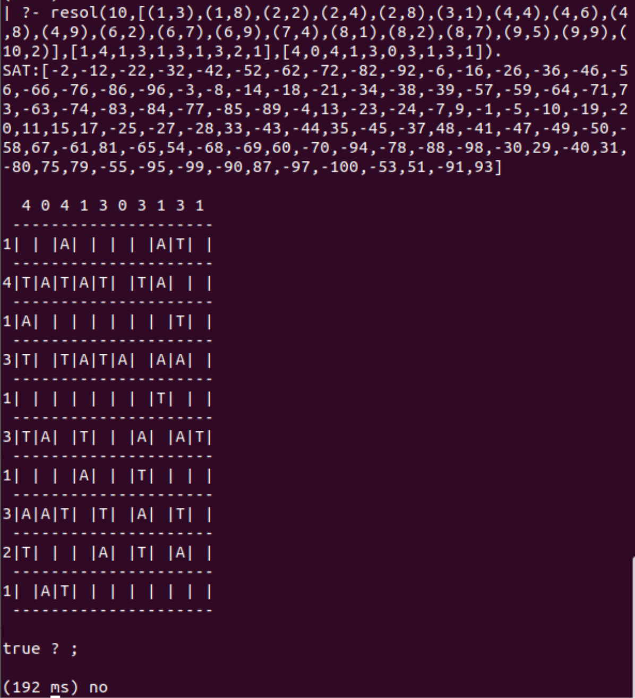

# Tents-Puzzle

SAT solver in Prolog to find solutions for different configurations of the ["Tents" problem](https://www.chiark.greenend.org.uk/~sgtatham/puzzles/js/tents.html) (NP-problem).

Given a description of a problem instance (the size of the grid, the location of the trees using row column coordinates, a list with the number of tents per row and a list with the number of tents per column), it displays on the terminal the set of existing solutions when there is at least one.

The constraints of the problem are:
- no two tents are adjacent, even diagonally
- the number of tents in each row and column matches the numbers around the edge of the grid
- each tree must have at least one tent by its side (above, below, left, or right). Two trees can share the same tent
  
## Example of execution

Example of grid 10x10 with only one solution found:

